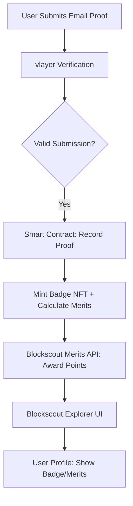
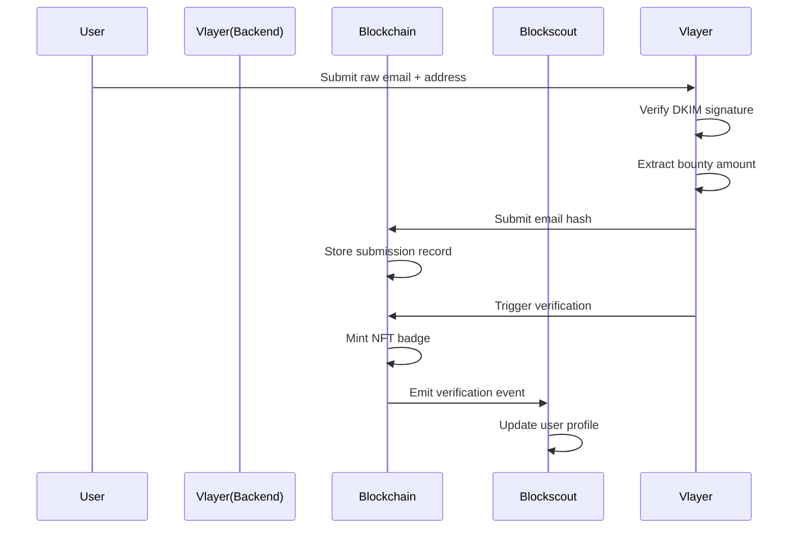

## Ideas :
- Verifiable Bug Bounty submission !
- Proof-of-Employment On-Chain using world coin
- Generate avatar based on your wins and participation in hackathons (NFT ?)


- Proof of Residency for Regulatory Compliance
- ENS email ownership
- 

- extension for auti filling 2fa codes or maybe anti phishing extension


## Best Idea :
### Verifiable Bug Bounty submission
**Bounties** :
- Blockscout (All bounties)
- Vlayer (Email Proof, Most inspiring)

**Description** :
- so basically the user will upload the email with the congratulations message that he found the bug, and if the email is proven to be a valid submission a badge will be generated plus some merits will be given to him based on how much money he made from the bug, and then any user can on chain verify the proof using blockscout api, and the user page will be updated with the new badge or/and merit collected from this submission.




### Technical Diagram :



## Info 
```
$ VLAYER_ENV=testnet bun run prove.ts
Deploying vlayer contracts...
Deploying prover contract...
Prover deployed at: 0x6ded4f60be639e8e1870aa42c84561e5112c7534
Deploying verifier contract...
Verifier deployed at: 0x604125bcee6e8b38d910d59a9edd7a3085f8b53b
Proving...
Waiting for proving result...
Proof generated successfully!
Submission details:
  - Reporter: 0x1111111111111111111111111111111111111111
  - Platform: HackerOne
  - Severity: Critical
  - Merits: 100
  - Submission ID: SUB_faf303b1a7a1c3f19f5995f4da5540702277a32e3867c5c154ba5f5ee651e60c
  - Timestamp: 1748651190
  - Verified: true
  - Token ID: 0
Submitting proof to registry...
Waiting for transaction confirmation...
Verification result: success
🎉 Bug bounty badge successfully awarded!
Updated user stats:
  - Total Merits: 100
  - Badge Count: 1
  - Critical Count: 1
  - High Count: 0
  - Medium Count: 0
  - Low Count: 0

Badge details:

Badge #1:
  - Platform: HackerOne
  - Severity: Critical
  - Merits: 100
  - Token ID: 1                                   051808201825260068152654d656469756d60d01b602082015
```
