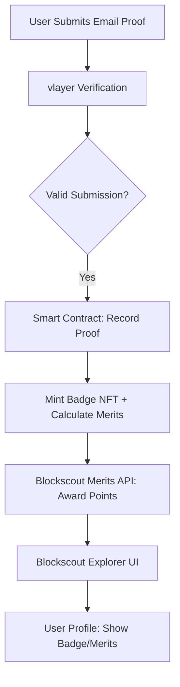
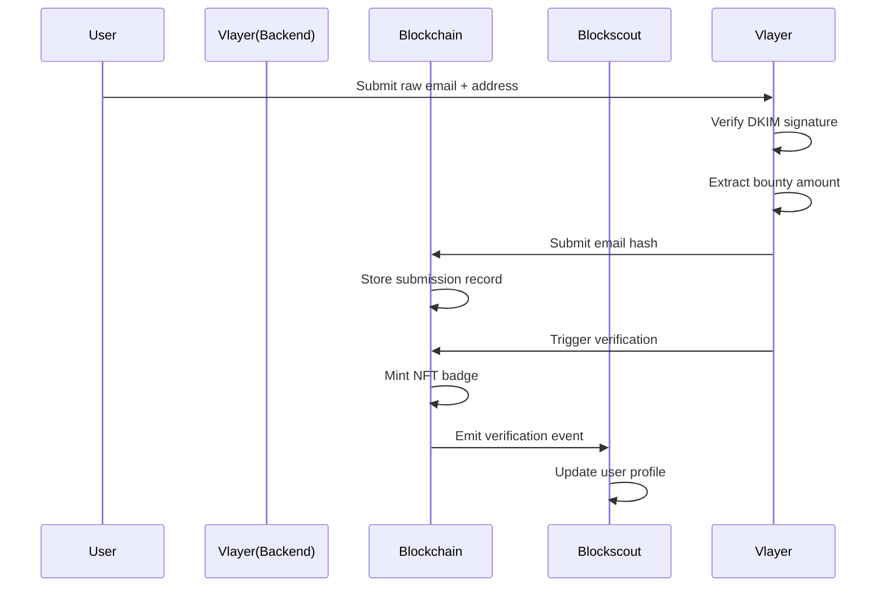

## Ideas :
- Verifiable Bug Bounty submission !
- Proof-of-Employment On-Chain using world coin
- Generate avatar based on your wins and participation in hackathons (NFT ?)

- Proof of Residency for Regulatory Compliance
- ENS email ownership
- 

- extension for auti filling 2fa codes or maybe anti phishing extension

## Best Idea :
### Verifiable Bug Bounty submission
**Bounties** :
- Blockscout (All bounties)
- Vlayer (Email Proof, Most inspiring)

**Description** :
- so basically the user will upload the email with the congratulations message that he found the bug, and if the email is proven to be a valid submission a badge will be generated plus some merits will be given to him based on how much money he made from the bug, and then any user can on chain verify the proof using blockscout api, and the user page will be updated with the new badge or/and merit collected from this submission.

### Technical Diagram :

